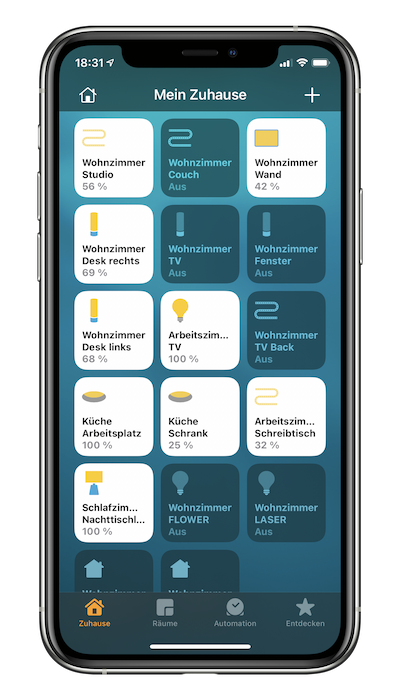

# Zigbee, Homekit and a Pi

In this post I want to summarize my experiences with Homekit using Zigbee hardware, the various vendors and my personal approach.

I am using smart home stuff for quite a while now and I've not touched all areas, yet. The stuff I use is primarily lighting, sockets and some sensors. The sensors include temperature & co as well as contact sensors for windows.



### Philips Hue

I am a big [Philips Hue](https://www.philips-hue.com/en-us) fan. The lights are fantastic. I have simple white bulbs, RGB bulbs and of course light strips everywhere. I especially recommend to use them for kitchen lights under your wall cabinets. I also use the dimmer switches, some rooms even have two or three of them installed.

The sockets I use are from [Osram](https://www.osram.com/cb/lightify/index.jsp) and they are not officially Homekit certified but work ok in Philips Hue. I could add them as a light (stupid idea btw) and then make them accessible with a trick: [Homebridge](https://github.com/homebridge/homebridge). This is a piece of software that turns non-Homekit stuff into devices that are usable with Apple's Home ecosystem. To run this software as a mini server I recommend to use a Raspberry Pi.

These little computers are awesome. They are cheap and highly versatile. If I would still work as an electronics engineer, I would love to tinker and build stuff with these litte wonders. As I don't I only use them to control my smart home.

### Homebridge is your friend

Speaking of [Homebridge](https://github.com/homebridge/homebridge), this software perfectly runs on a Raspberry Pi. It's a small Node.js based app. I described how to set it up here: [Setting up Homebridge on a Pi](https://github.com/zeromancer1972/homebridge_pi)

The Hue approach, though working fine with the original lights and the Osram sockets, has it's limitations though. I knew from a friend that he's able to use very cheap China stuff from Aqara (Xiaomi) in his home without using Philips or Apple (he is not an Apple user at all). All you need is a Zigbee gateway to support the common Zigbee standard, a simple radio protocol that even can span big distances inside your home across rooms - more than Bluetooth and Wifi whilst having a very low power consumption.

### Zigbee Gateway

There are several devices that can act as a local Zigbee gateway. I chose the [Conbee 2 USB stick](https://phoscon.de/en/conbee2) (also available as a RPi module). It's recommended to use this USB stick with a cable in order to avoid interferences with the Pi hardware it self (esp. the Wifi signal). Of course you can use this stick on PCs as well, but you may not run a big machine 24/7 to serve this purpose. A Raspberry Pi is ideal for this kind of work.

### The Operating System

A Raspberry Pi usually runs with Raspbian, a Debian clone (which I personally like the most). It's very easy and straight forward to get it up and running. If you are using the [Noobs image](https://www.raspberrypi.org/downloads/noobs/), it totally fine just to install the simple server flavour without a graphical user interface - we do not need it.

### Installing Docker

As we are going to install Homebridge and the software for the Zigbee gateway, I recommend to use Docker to run both on the same machine. You could install both natively on Raspbian, too, but with updates to the OS that may come, you will never know if this affects your installations. With Docker, you cage both environments inside a container that runs it's own OS (in very small parts). Docker runs fine on a Raspberry Pi 3, the Pi 4 is even better of course due to it's larger memory. I run both parts in Docker on a Intel NUC which is quite an overkill for this use case. Specs-wise it's similar to a Raspberry but the processor is faster which is not a relevant part here though.

To install docker just run these commands:

```
sudo apt-get update && sudo apt-get upgrade

curl -fsSL https://get.docker.com -o get-docker.sh

sudo sh get-docker.sh
```

### Container Management

Homebridge is best installed using a so called Docker-compose file (or stack). The easiest way to use a stack is to use a graphical UI to manage containers. Remember? We don't have any GUI for our little smart home server, right? I recommend to use [Portainer](https://www.portainer.io/installation/) for this task. With Docker installed on your system, it's just two line in the console to get it up and running:

```
docker volume create portainer_data

docker run -d -p 8000:8000 -p 9000:9000 --name=portainer --restart=always -v /var/run/docker.sock:/var/run/docker.sock -v portainer_data:/data portainer/portainer-ce
```

To access portainer, open the URL in your browser of choice and provide the initial admin credentials:

`http://yourMachineNameOrIP:9000`

With Portainer you are able to use Homebridge in a Docker container: [Homebridge for Docker](https://github.com/oznu/docker-homebridge).

I use this stack config for my Homebridge:

```yaml
version: '2'
services:
  homebridge:
    image: oznu/homebridge:ubuntu
    container_name: homebridge
    restart: always
    network_mode: host
    environment:
      - PGID=1000
      - PUID=1000
      - HOMEBRIDGE_CONFIG_UI=1
      - HOMEBRIDGE_CONFIG_UI_PORT=8083
      - TZ=Europe/Berlin
    volumes:
      - /homebridge
```

You can see, it's automatically coming with a nice UI to configure your Homebridge settings. I recommend to use this port (8083), too, as you may want to run another container in the future that might use port 80 (HTTP), so this keeps this one available. In our case the software for the Conbee gateway runs on port 80 by default, but we are going to also change this setting.

### Installing the Phoscon App

The Conbee Zigbee stick needs some love, too. To get it up and running you need to do some steps:

- adding the root user to the dial-out group
- create a folder for the local configuration
- pull and run the Docker stuff

Execute these commands on your Raspberry machine:

```
sudo gpasswd -a $USER dialout

mkdir -p ~/.local/share/dresden-elektronik/deCONZ

docker run -d \
   --name=deconz \
   --net=host \
   --restart=always \
   -v /etc/localtime:/etc/localtime:ro \
   -v ~/.local/share/dresden-elektronik/deCONZ:/root/.local/share/dresden-elektronik/deCONZ \
   --device=/dev/ttyACM0 \
   -e DECONZ_DEVICE=/dev/ttyACM0 \
   marthoc/deconz
```

This spins up the container `deconz` for the so called `Phoscon App`, the UI for the Zigbee gateway to configure your smart gadgets.

As mentioned above, we are going to use also different ports to access this app to preserve the common ports for other purposes. By default, the `deconz` container will use port 80 for HTTP connections. You should modify them in the config file in the folder you just created above:

```
nano ~/.local/share/dresden-elektronik/deCONZ/config.ini
```

Find the line
```
port=80
```

and change it to

```
port=8081
```

Save your changes and then restart the container using the Portainer UI. Once this container is up again (this will only take a few seconds), you are able to access it in your browser:

`http://yourMachineNameOrIP:8081/pwa`

This opens up the screen where your stick should be displayed. Please follow the instruction on how to proceed from here to add devices to your network on the [official documentation](https://phoscon.de/en/app/doc).

In the end you should see something like this in Portainer when navigating to the `Container` section:

